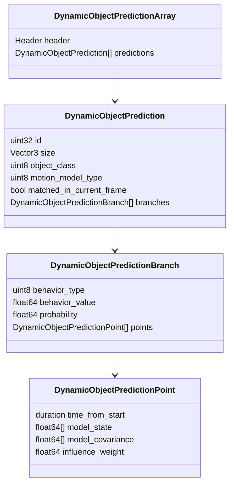
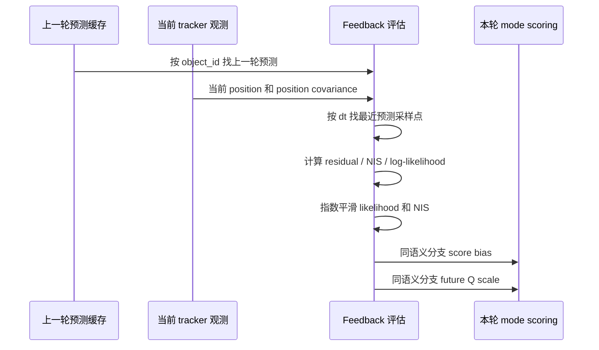

# LDOP 轨迹预测实现教材式说明

本文面向刚接触 LDOP 轨迹预测模块的读者，目标不是逐行复述代码，而是像教材一样解释：这个模块要解决什么问题，输入输出是什么，算法按什么顺序运行，每个公式和参数在工程里分别对应什么。

代码入口主要在：

- `include/ldop/dynamic_object_predictor.h`
- `src/dynamic_object_predictor.cpp`
- `include/ldop/prediction_interaction_context.h`
- `src/prediction_interaction_context.cpp`
- `src/ldop.cpp`
- `src/dynamic_object_tracker.cpp`
- `msg/DynamicObjectPrediction*.msg`
- `config/ldop.yaml`

## 1. 先给结论

当前 LDOP 的轨迹预测模块已经不是简单的“按当前速度往前画一条线”。它的实际结构是一个短时、在线、可解释的多分支预测器：

```text
稳定跟踪目标
  -> 提取运动历史特征
  -> 生成若干意图/运动模式
  -> 用 softmax 得到每个模式的概率
  -> 按对应运动模型 rollout 出未来轨迹和协方差
  -> 用目标间交互、静态地图、free corridor 重新调整概率和轨迹
  -> 可选：用上一帧预测误差反馈下一帧模式概率和过程噪声
  -> 发布 prediction msg 和 RViz marker
```

可以把它理解为一个 **trajectory-level GMM**：

```text
p(未来轨迹 | 当前跟踪状态) = Σ 分支概率 × 该分支的一条高斯轨迹
```

这里的每个“分支”不是一条随便采样出来的线，而是一个有语义的预测假设，例如继续前进、减速、左转、右转、横向避让、上升或下降。每个分支保存自己的未来状态序列、协方差序列和概率。

需要特别注意当前默认运行配置：

- `prediction_enable_interaction_context: true`，所以 P3 交互感知预测默认启用。
- `prediction_enable_feedback: false`，所以 P4 闭环反馈代码已经实现，但按当前 `config/ldop.yaml` 默认不启用；改成 `true` 后才会让上一轮预测误差影响下一帧分支概率和未来过程噪声。

## 2. 系统位置

LDOP 主流程中，轨迹预测位于动态目标跟踪之后：

```mermaid
flowchart LR
  A[输入点云 + 里程计] --> B[UfomapMapper<br/>动静态分割与静态地图]
  B --> C[DynamicObjectClusterer<br/>当前帧动态点聚类]
  C --> D[DynamicObjectTracker<br/>跨帧关联与稳定 ID]
  D --> E[DynamicObjectPredictor<br/>短时轨迹预测]
  E --> F[/ldop/dynamic_object_predictions]
  E --> G[/ldop/dynamic_prediction_markers]
```

这条边界很重要：predictor 不重新处理点云，也不自己做数据关联。它只消费 tracker 已经确认的稳定目标快照。因此，预测模块关心的是“稳定目标未来可能怎么走”，不是“这个动态点云是不是一个目标”。

在 `Ldop::processFrame()` 中，流程大致是：

```text
UfomapMapper 得到动态点
  -> DynamicObjectClusterer 得到 detections
  -> DynamicObjectTracker 得到 stable tracks 和 prediction_inputs
  -> DynamicObjectPredictor::predict(header, prediction_inputs, map_query)
  -> Ldop::publishFrame() 统一发布预测消息和 marker
```

其中 `UfomapPredictionMapQuery` 是一个只读适配器，把 UFOMap 查询能力转成 predictor 需要的地图接口。

## 3. 输入：TrackPredictionInput

预测输入是 tracker 内部构造的 `TrackPredictionInput`。它比 `/ldop/dynamic_objects` 这类 ROS 输出更适合做预测，因为它保留了模型原生状态、协方差和历史样本。

核心字段如下：

| 字段 | 教材式解释 | 用途 |
|---|---|---|
| `id` | 稳定目标 ID | 跨帧匹配和反馈缓存 |
| `object_class` | 目标类别，如 Human、Vehicle、Uav、Unknown | 决定候选意图集合 |
| `motion_model_type` | 当前运动模型，如 CV3D、CA2D、CA3D、CTRA | 决定状态维度和传播公式 |
| `model_state` | 当前滤波后的模型原生状态 | rollout 的初值 |
| `model_covariance` | 当前模型原生协方差 | 未来协方差传播的初值 |
| `bbox` | 跟踪框尺寸 | 交互安全距离和消息输出 |
| `history` | 最近历史状态快照 | 估计航向、速度趋势和历史质量 |
| `age/hits/missed_frames` | 轨迹生命周期信息 | 判断历史质量和漏检影响 |
| `matched_in_current_frame` | 当前帧是否真实匹配到检测 | RViz 透明度和 P4 反馈门控 |

预测模块假设这些输入已经由 tracker 建立内部契约：状态维度要匹配运动模型，协方差要是对应维度的方阵。对这种内部数据流，代码主要用 `assert` 表达不变量，而不是把它当外部不可信输入反复清洗。

## 4. 输出消息

预测输出走独立话题 `/ldop/dynamic_object_predictions`，消息层级如下：



读这套消息时要抓住三层含义：

1. `prediction` 是一个目标。
2. `branch` 是该目标未来的一种可能走法。
3. `point` 是该走法在某个未来时间采样点上的模型原生状态和协方差。

`motion_model_type` 是解释 `model_state` 和 `model_covariance` 的钥匙。同样是 `model_state[3]`，在不同模型里可能代表不同运动量，所以消费者不能脱离 `motion_model_type` 解读状态向量。

## 5. 预测主流程

`DynamicObjectPredictor::predict()` 可以按下面的伪代码理解：

```text
输入：当前 header、tracker 稳定目标 inputs、可选地图查询 map_query

1. 如果 P4 feedback 启用：
     清理过期反馈缓存
     用当前观测评估上一轮预测，生成本轮 mode hints

2. 对每个目标 input：
     复制 id、size、class、motion model 等基础信息
     从历史里估计运动特征
     根据类别和运动特征生成候选 modes
     对 mode 做 softmax、概率阈值过滤、最多分支裁剪
     对每个 mode 按运动模型 rollout 成预测 branch

3. 如果 P3 interaction 启用：
     评估目标间、目标-地图、free corridor 交互代价
     用交互能量缩放 branch probability
     把局部修正 hint 平滑为控制 profile
     对需要修正的 branch 重新 rollout
     重新归一化概率

4. 构建 RViz 预测轨迹线 marker

5. 如果 P4 feedback 启用：
     缓存当前预测快照，供下一帧评估

输出：预测消息、marker、diagnostics 和耗时
```

流程图如下：

```mermaid
flowchart TD
  A[TrackPredictionInput[]] --> B{P4 feedback enabled?}
  B -- yes --> C[上一轮预测 vs 当前观测<br/>生成 score bias / Q scale hint]
  B -- no --> D[历史特征估计]
  C --> D
  D --> E[按类别生成候选预测模式]
  E --> F[softmax + 剪枝 + 概率归一化]
  F --> G[逐模式运动模型 rollout]
  G --> H{P3 interaction enabled?}
  H -- yes --> I[目标间 / 地图 / corridor 交互评估]
  I --> J[概率重加权 + 平滑控制重新 rollout]
  H -- no --> K[原始分支]
  J --> L[预测消息]
  K --> L
  L --> M[RViz LINE_STRIP marker]
  L --> N[缓存预测快照供下一帧反馈]
```

## 6. 第一步：从历史估计运动特征

预测不能只看当前一帧速度，因为单帧速度可能被噪声、遮挡或模型切换影响。代码先从历史窗口里估计一些简单但很关键的特征。

`estimateHistoryFeatures()` 会得到：

| 特征 | 含义 |
|---|---|
| `heading` | 水平运动主方向 |
| `speed` | 当前水平速度大小 |
| `previous_speed` | 历史窗口起点附近的水平速度 |
| `speed_delta` | 当前速度与历史起点速度之差，用于判断是否在减速 |
| `vertical_speed` | 当前 z 方向速度 |
| `heading_instability` | 历史局部方向相对整体方向的平均偏差 |
| `history_quality` | 可用历史样本数量是否足够 |
| `history_quality_scale` | 给未来过程噪声使用的质量惩罚系数 |

如果历史足够，主方向优先用历史位移方向，而不是瞬时速度方向。这样做的原因是：瞬时速度容易抖，历史位移更像“这段时间真的往哪儿走”。

历史质量会影响未来不确定性。代码把三个因素合成一个惩罚：

```text
历史不足程度
漏检比例
航向不稳定程度
```

然后得到：

```text
history_quality_scale = 1 + (history_quality_noise_scale - 1) * quality_penalty
```

直觉是：历史短、漏检多、方向不稳的目标，未来预测应该更不确定。

## 7. 第二步：生成候选意图分支

代码内部把每个候选走法表示为 `PredictionMode`。它包含：

| 字段 | 含义 |
|---|---|
| `kind` | 具体模式，如 Keep、TurnLeft、VerticalClimb |
| `behavior_type` | 对外消息中的行为族 |
| `behavior_value` | 行为强度，通常用正负号表示方向 |
| `score` | softmax 前的启发式分数 |
| `probability` | softmax 后的分支概率 |
| `mode_uncertainty_scale` | 该假设本身带来的未来噪声放大 |
| `feedback_noise_scale` | P4 反馈给该语义分支的未来噪声尺度 |

行为族和当前含义如下：

| `behavior_type` | 常见 `behavior_value` | 教材式解释 |
|---|---:|---|
| `BEHAVIOR_LONGITUDINAL` | `0.0` | 继续当前趋势 |
| `BEHAVIOR_LONGITUDINAL` | `-0.45` | 减速 |
| `BEHAVIOR_LONGITUDINAL` | `-1.0` | 停止倾向 |
| `BEHAVIOR_TURNING` | `+1.0 / -1.0` | 左转 / 右转 |
| `BEHAVIOR_LATERAL` | `+1.0 / -1.0` | 相对航向左避让 / 右避让 |
| `BEHAVIOR_VERTICAL` | `+1.0 / -1.0 / 0.0` | 上升 / 下降 / 保持高度 |

类别决定候选集合：

| 类别 | 候选模式 |
|---|---|
| Human | keep、减速、停止、左右转、左右横向避让 |
| Vehicle | keep、减速、左右转 |
| Uav | keep、减速、左右转、上升、下降、保持高度 |
| Unknown / Other | 默认保守；只有航向不稳、减速或 z 速度证据明显时才补充分支 |

这体现了一个工程上的保守原则：已知人类目标可以有较多横向行为；车辆更偏向纵向和转向；UAV 才默认考虑垂直行为；未知目标不要过度幻想复杂意图。

## 8. 第三步：分数转概率

候选模式先拿到启发式 `score`，再经过 softmax 变成概率：

```text
probability_i = exp(score_i - max_score) / Σ exp(score_j - max_score)
```

减去 `max_score` 是标准数值稳定技巧，避免 `exp(score)` 过大。

然后执行两步剪枝：

1. 去掉低于 `prediction_min_branch_probability` 的分支。
2. 最多保留 `prediction_max_branches` 个最高概率分支。

剪枝后会再次归一化，保证同一目标所有保留分支概率和为 1。

如果所有分支都被过滤掉，代码会保留原始最高分分支，避免输出空预测。

## 9. 第四步：按运动模型 rollout

rollout 的意思是：从当前滤波状态出发，一步一步往未来传播。

LDOP 复用跟踪阶段的运动模型：

| 模型 | 直观含义 |
|---|---|
| `CV3D` | 三维匀速模型 |
| `CA2D` | 水平面匀加速度，z 维保持轻量处理 |
| `CA3D` | 三维匀加速度 |
| `CTRA` | 带速度、加速度、航向和角速度的转弯模型 |

每个分支从 tracker 当前状态开始：

```text
state_0 = input.model_state
P_0     = input.model_covariance
```

每个采样步做三件事：

1. 根据 mode 修改当前状态里的控制含义，例如减速、设置角速度、添加横向速度、设置垂直速度。
2. 调用对应运动模型做状态传播。
3. 用线性化传播协方差。

协方差传播公式是：

```text
P_next = F * P * F^T + Q_scaled
```

其中：

```text
Q_scaled = history_quality_scale
         * mode_uncertainty_scale
         * feedback_noise_scale
         * Q_base
```

这几个尺度分别表达：

| 尺度 | 表达的含义 |
|---|---|
| `history_quality_scale` | 历史越差，未来越不确定 |
| `mode_uncertainty_scale` | 假设性更强的分支比 keep 更不确定 |
| `feedback_noise_scale` | P4 根据上一轮预测一致性校正未来过程噪声 |
| `Q_base` | 当前运动模型自己的基础过程噪声 |

输出的每个 `DynamicObjectPredictionPoint` 保存：

```text
time_from_start
model_state
model_covariance
influence_weight
```

`influence_weight` 不改变协方差，只是给规划/RViz 的影响权重。当前规则是前半段保持 1.0，后半段线性衰减到 0.3。直觉是：短期预测更可信，远端预测仍要提示风险但影响不要过强。

## 10. 第五步：交互感知预测

P3 交互模块由 `PredictionInteractionContext` 实现。它不直接发布 ROS 消息，而是给 predictor 返回每个目标、每个分支的交互代价、概率缩放和局部修正建议。

整体结构如下：

```mermaid
flowchart TD
  A[已 rollout 的 GMM 分支] --> B[目标间 pair cost]
  A --> C[静态地图 map cost]
  A --> D[free corridor cost]
  B --> E[total_energy]
  C --> E
  D --> E
  E --> F[probability_scale = exp(-E / tau)]
  E --> G[risk level]
  B --> H[局部避让 / 减速 hint]
  C --> H
  D --> H
  H --> I[平滑控制 profile]
  F --> J[分支概率重加权]
  I --> K[重新 rollout 均值轨迹]
```

### 10.1 目标间交互

目标间交互主要看三件事：

1. 两条分支在同一未来采样点是否距离过近。
2. 相对速度是否会在短时间内接近，即 TTC 是否危险。
3. 迎面、交叉、同向跟随等关系带来的风险强弱。

安全距离使用目标水平外接圆半径，加上参数 `prediction_interaction_safe_distance`。如果两条分支太近，就增加 `pair_cost`，并生成一个“把当前分支推离对方”的位置修正 hint。若 TTC 太小，还会生成减速 hint。

代码对其他目标的多分支风险按概率求期望：高概率冲突分支影响更大，零概率分支不会泄露副作用。

### 10.2 静态地图交互

地图交互使用 `PredictionMapQuery` 查询 UFOMap，不直接依赖 UFOMap 具体类型。这样 predictor 只知道“可查 occupied/free/seenFree”，不需要知道地图怎么存。

地图 cost 主要看：

1. 分支是否进入 occupied 体素。
2. 分支是否贴近障碍物。
3. 分支附近是否存在更合理的 free corridor 方向。

一个容易忽略的工程点是：地图查询不是对每个采样点都单独查一遍，而是先用整条分支的包围区域做分支级 `queryLocalOccupied()`，再在局部 occupied 列表里计算最近障碍证据。这能避免查询次数随 `points * directions` 膨胀。

### 10.3 free corridor 方向先验

free corridor 逻辑会在分支代表位置周围检查 8 个方向的 `seenFree()`。如果不是全方向都 free，也不是完全没有 free，就认为局部存在方向偏置。

如果分支运动方向和可通行方向相反，`corridor_cost` 会变大；如果方向一致，cost 更小。同时它会生成一个轻量 `direction_bias`，提示重新 rollout 时把速度方向稍微偏向可通行空间。

### 10.4 交互能量如何影响分支

交互总能量是：

```text
total_energy =
  pair_interaction_weight     * pair_cost
+ map_interaction_weight      * map_cost
+ corridor_interaction_weight * corridor_cost
```

概率缩放是：

```text
probability_scale = exp(-total_energy / interaction_energy_tau)
```

因此能量越高，分支概率越低。predictor 会把原分支概率乘以这个缩放值，然后重新归一化。

如果某个分支还带有局部修正 hint，predictor 不会直接把未来点硬挪过去。它会先把 hint 平滑成控制 profile，再交给运动模型重新 rollout。这样生成的中心轨迹仍然是连续运动模型的结果，不会在某个采样点突然折一下。

还有一个边界很重要：交互逻辑只改变分支概率和均值轨迹控制，不因为“这个分支风险高”就人为缩小 `model_covariance`。协方差仍然由运动模型传播，避免把风险代价误当成统计置信度。

## 11. 第六步：P4 闭环反馈

P4 的目标是让 predictor 记住“上一帧我预测过什么”，下一帧再看“真实跟踪结果更接近哪个分支”。如果某个语义分支最近总是解释得更好，它下次的概率先验就应该更高；如果某个分支预测误差偏大，它下次的未来过程噪声就应该更大。

当前代码已经实现 P4，但 `config/ldop.yaml` 默认 `prediction_enable_feedback: false`，所以默认运行不启用。

P4 内部缓存不是 ROS 消息，也不跨模块共享。它按目标 ID 保存上一轮预测快照：

```text
object_id
  last_stamp
  last_prediction:
    branch_key = behavior_type + behavior_value_bucket
    samples:
      time_from_start
      predicted position
      predicted position covariance
  branch_states:
    smoothed_log_likelihood
    smoothed_nis
    probability_score_bias
    process_noise_scale
```

下一帧来了以后，feedback 的计算顺序是：



核心统计量是 innovation：

```text
innovation = observed_position - predicted_position
S = predicted_position_covariance + observed_position_covariance
NIS = innovation^T * S^-1 * innovation
```

位置是三维的，所以理想情况下 NIS 的期望大约是 3。代码用这个直觉调过程噪声：

```text
nis_ratio = smoothed_nis / 3
process_noise_scale *= exp(clamp(noise_gain * (nis_ratio - 1), -0.5, 0.5))
```

然后把它限制在 `[0.3, prediction_feedback_max_noise_scale]` 内。下界 0.3 是代码内部固定值，避免反馈把未来不确定性压到不可恢复的零。

概率先验来自 log-likelihood。代码会在同一目标的分支之间做居中：

```text
score_bias_z = smoothed_log_likelihood_z - mean(smoothed_log_likelihood_all_branches)
```

然后在下一轮生成 mode 时：

```text
mode.score += prediction_feedback_probability_gain * score_bias_z
mode.feedback_noise_scale = process_noise_scale_z
```

分支匹配使用 `behavior_type + behavior_value` 的近似桶，而不是 branch index。这样即使 softmax 排序和剪枝改变了分支顺序，feedback 仍然能落到语义相近的分支上。

## 12. 可视化

预测可视化发布到 `/ldop/dynamic_prediction_markers`。

当前实现只显示真实保留 GMM 分支的中心状态轨迹线：

- 每个分支一个 `LINE_STRIP`。
- 第一条 marker 使用 `DELETEALL` 清理旧 marker。
- 匹配目标透明度更高，漏检延续目标透明度更低。
- 分支概率越高，透明度略高。
- 颜色按行为族区分：
  - 纵向：青色
  - 转向：红色
  - 横向：绿色
  - 垂向：品红色

当前不显示额外 sample 轨迹，也不显示不确定性椭球。这样做是为了让 RViz 只表达真实消息里的 GMM 分支，避免调试者把“额外采样线”误认为下游可以消费的预测契约。

## 13. 参数速查

### 13.1 基础预测参数

| 参数 | 当前 YAML 值 | 含义 |
|---|---:|---|
| `prediction_horizon` | `1.0` | 预测未来时长，单位秒 |
| `tracking_default_dt` | `0.1` | 预测采样间隔复用 tracker 默认 dt |
| `prediction_max_branches` | `3` | 每个目标最多保留几个 GMM 分支 |
| `prediction_min_branch_probability` | `0.05` | 低于该概率的分支会被过滤 |
| `prediction_history_window` | `20` | 估计历史特征使用的最近样本数 |
| `prediction_heading_stable_angle` | `0.35` | 航向稳定阈值，单位 rad |
| `prediction_stop_speed` | `0.2` | 减速/停止模式使用的速度尺度 |
| `prediction_turn_yaw_rate` | `0.5` | 转向模式使用的角速度幅值 |
| `prediction_lateral_speed` | `0.4` | 横向避让速度幅值 |
| `prediction_vertical_speed` | `0.3` | UAV 垂向速度幅值 |
| `prediction_history_quality_noise_scale` | `1.5` | 历史质量差时的未来噪声放大上限 |
| `prediction_hypothesis_noise_scale` | `1.3` | 假设性分支相对 keep 分支的噪声放大 |

### 13.2 交互参数

| 参数 | 当前 YAML 值 | 含义 |
|---|---:|---|
| `prediction_enable_interaction_context` | `true` | 是否启用 P3 交互感知预测 |
| `prediction_pair_interaction_weight` | `1.0` | 目标间交互代价权重 |
| `prediction_map_interaction_weight` | `1.0` | 静态地图代价权重 |
| `prediction_corridor_interaction_weight` | `0.4` | free corridor 方向先验权重 |
| `prediction_interaction_safe_distance` | `0.4` | 目标尺寸外额外安全距离 |
| `prediction_near_obstacle_distance` | `0.6` | 近障碍软惩罚半径 |
| `prediction_map_query_depth` | `0` | UFOMap 查询深度，0 为叶子 |
| `prediction_ttc_safe_time` | `1.5` | TTC 低于该时间认为短时风险高 |
| `prediction_free_corridor_query_radius` | `1.2` | corridor 方向采样半径 |
| `prediction_max_correction_distance` | `0.2` | 单点最大位置修正距离 |
| `prediction_max_deceleration_ratio` | `0.35` | 单点最大减速比例 |
| `prediction_interaction_energy_tau` | `1.0` | 交互能量转概率缩放的温度 |

### 13.3 闭环反馈参数

| 参数 | 当前 YAML 值 | 含义 |
|---|---:|---|
| `prediction_enable_feedback` | `false` | 是否启用 P4 闭环反馈 |
| `prediction_feedback_max_age` | `1.5` | 反馈缓存最大有效时间 |
| `prediction_feedback_probability_gain` | `1.0` | likelihood bias 对 mode score 的影响 |
| `prediction_feedback_noise_gain` | `0.25` | NIS 偏离期望时 Q scale 调整速度 |
| `prediction_feedback_max_noise_scale` | `3.0` | 未来 Q 的最大闭环放大尺度 |
| `prediction_feedback_smoothing_alpha` | `0.35` | NIS/likelihood 指数平滑权重 |
| `prediction_feedback_behavior_value_bucket` | `0.25` | 跨帧匹配同语义分支的行为值桶大小 |
| `prediction_feedback_max_sample_time_error` | `0.15` | 预测采样点与实际 dt 的最大允许偏差 |

## 14. 用一个例子串起来

假设 tracker 给 predictor 一个稳定的人类目标：

```text
id = 7
class = Human
motion model = CV3D
当前速度约 1 m/s
历史方向稳定
没有漏检
```

predictor 会做：

1. 估计历史特征：航向稳定、速度趋势基本不变、历史质量高。
2. 生成 Human 候选：keep、减速、停止、左转、右转、左横移、右横移。
3. 给 keep 更高初始分数，因为历史稳定。
4. softmax 后可能保留概率最高的 3 个分支，例如 keep、左转、右转。
5. 对每个分支从当前 CV3D 状态往未来 1 秒 rollout，每 0.1 秒一个点。
6. 如果前方有另一个目标横穿，交互模块会降低冲突分支概率，并可能给当前分支一个减速或避让 hint。
7. RViz 中看到的是几条不同颜色的未来中心线，概率更高的线更明显。
8. 如果 P4 开启，下一帧真实观测更接近左横移分支，则左横移语义分支下一帧会得到更高 score bias。

## 15. 这套实现的学习重点

从初学者角度，理解当前实现可以按四个层次递进：

1. **运动模型层**：先理解 `stateTransition()` 和 `P_next = FPF^T + Q`。这是预测的物理骨架。
2. **多分支层**：再理解为什么同一个目标需要多个未来假设。现实里“左转”和“右转”不能平均成一条中间线。
3. **交互层**：然后理解未来轨迹不是孤立的。目标会避开其他目标，也不能穿墙。
4. **反馈层**：最后理解预测器也要从错误中学习。上一帧哪个分支预测得准，下一帧就应该更相信它；哪个分支误差异常，未来就应该更不确定。

对应到代码：

```text
运动模型层：motion_model.cpp / multi_model_kalman_filter.cpp
多分支层：dynamic_object_predictor.cpp 中的 PredictionMode、generatePredictionModes、rollOutMode
交互层：prediction_interaction_context.cpp 和 applyInteractionResult
反馈层：dynamic_object_predictor.cpp 中的 storeFeedbackSnapshots、buildFeedbackHints
```

## 16. 当前测试覆盖了什么

预测相关测试主要在：

- `test/test_dynamic_object_predictor.cpp`
- `test/test_prediction_interaction_context.cpp`

覆盖重点包括：

- CV3D 基础预测采样点是否正确。
- Human、Vehicle、UAV、Unknown/Other 的分支集合是否符合类别语义。
- 左右横向、左右转向、UAV 垂向分支是否真的发散。
- 减速历史是否提高减速分支概率。
- 短历史、漏检和假设分支是否扩大未来协方差。
- 交互后分支概率是否仍然归一化。
- 目标间交叉、迎面、跟随的 pair cost 是否有区分。
- occupied、near obstacle、free corridor 是否影响地图交互代价。
- 交互修正是否通过重新 rollout 保持轨迹连续，而不是硬折线。
- P4 feedback 是否按语义分支提高概率、调整 Q scale，并在无效协方差或未匹配观测时跳过。
- RViz 当前只生成真实分支轨迹线，不生成 sample marker 或 uncertainty marker。

## 17. 常见误解

### 误解一：预测输出只有最高概率一条轨迹

不是。消息里每个目标有 `branches[]`，每个分支都有概率。最高概率分支可以叫 MAP trajectory，但它不是完整分布。

### 误解二：多分支可以先平均成一条轨迹

不建议。左转和右转平均后可能变成一条直走轨迹，而真实目标并不一定会直走。当前消息保留 GMM 分支，就是为了不丢掉多峰性。

### 误解三：交互 cost 越高，协方差就应该越小

不是。交互 cost 表示这个分支不合理或有风险，主要用于降低概率或生成轻量控制修正；协方差表示该分支内部统计不确定性，两者不能混用。

### 误解四：P4 已实现就等于默认运行启用

不是。P4 代码已经实现，但当前 YAML 默认 `prediction_enable_feedback: false`。需要显式打开后，上一轮预测误差才会影响下一帧分支 score 和未来 Q scale。

### 误解五：`prediction_max_branches` 控制轨迹采样点数量

不是。它控制每个目标最多保留多少个 GMM 分支。每个分支内部有多少个 `points[]`，由 `prediction_horizon / tracking_default_dt` 决定。

## 18. 一句话心智模型

当前 LDOP 轨迹预测可以这样记：

```text
tracker 给出“目标现在在哪里、怎么动、有多不确定”；
predictor 生成“它未来可能有哪些走法”；
interaction 删除或修正“不像真的走法”；
feedback 在开启时用下一帧事实校准“下次该更相信谁、该多不确定”。
```

